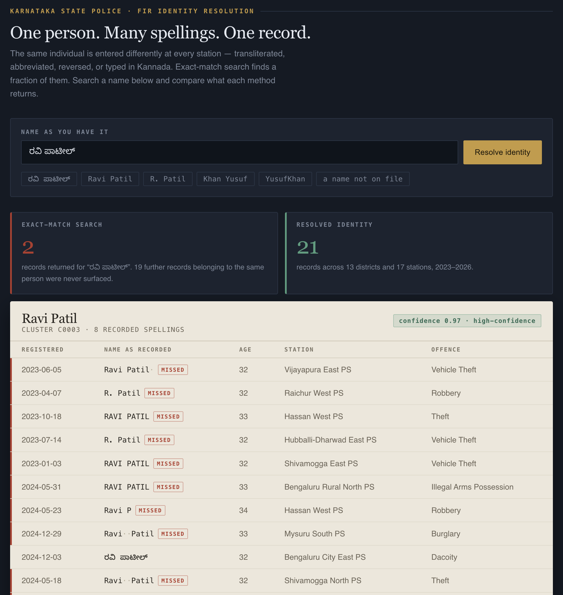
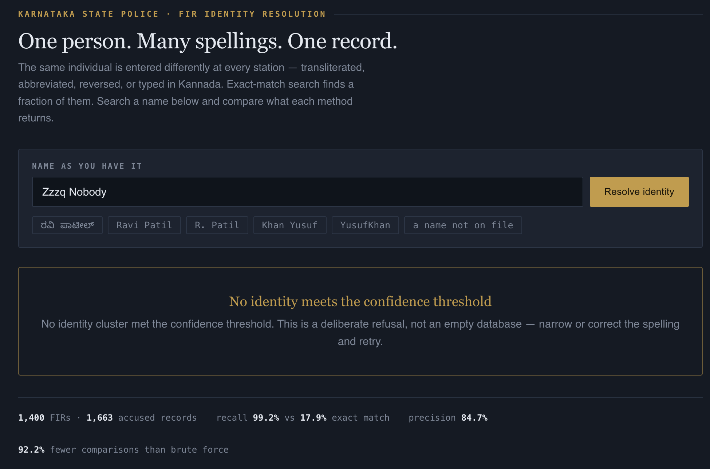

# KSP Identity Resolution

**One person. Many spellings. One record.**

An investigation-grade identity resolution layer for the Karnataka State Police FIR database.
Built for **KSP Datathon 2026**, Challenge 1 — *Intelligent Conversational AI for KSP Crime Database*.

**Live prototype:** https://ksp-crime-intel-60079832998.development.catalystserverless.in/app/index.html
*(deployed on Zoho Catalyst)*

---

## The problem

Karnataka runs more than 1,100 police stations, each entering names by hand, in two scripts,
with no shared spelling convention. The same individual becomes:

```
Ravi Patil        RAVI PATIL       Ravi  Patil      R. Patil
Patil Ravi        Ravi P           R.avi Patil      ರವಿ ಪಾಟೀಲ್
```

These are **eight recorded spellings of one man** — a real cluster from the corpus in this repo,
spanning 21 FIRs across 13 districts and 17 stations.

Exact-match search on `ರವಿ ಪಾಟೀಲ್` returns **2 of those 21 records**. The other 19 are invisible
to the investigator. Worse, a naive substring search for `%Patil%` AND `%avi%` returns
`Kavitha Patil` — a different person entirely — while still missing `R. Patil`, `Ravi P`
and the Kannada record.

**A false accusation and three missed leads, from a single query.**

No amount of natural-language sophistication above the database fixes this. If the record
cannot be reached by name, no question can surface it. So this project attacks the layer
underneath: **who is actually the same person.**

---

## What this does



An investigator types a name in any form — Latin or Kannada, complete or partial, correctly
spelled or not — and receives a single consolidated identity with every linked record,
the evidence for each link, and an explicit statement of what the system could not determine.

The interface is modelled on a **case docket**, not a chat window. Names render in monospace
so invisible data-entry damage — trailing spaces, double spaces, casing — becomes visible.
Every row that exact-match search would have missed carries a red edge and a `MISSED` tag.

### It refuses when it should



Below the confidence threshold the system returns **no answer**, and says so plainly.

In policing, a fabricated link is not a minor error — it is wrongful suspicion attached to a
real person. A system that cannot say *"I don't know"* is not safe to deploy in an
investigative context, however fluent it sounds.

---

## Results

Measured against held-out ground truth on 1,663 accused records.

| Method | Precision | Recall | F1 |
|---|---|---|---|
| Exact string match | 34.1% | 17.9% | 23.5% |
| **This engine** | **84.7%** | **99.2%** | **91.3%** |

**5.5× more true links recovered.**

| Metric | Value |
|---|---|
| Comparisons performed | 108,056 |
| Brute force would require | 1,381,953 |
| Search space pruned | **92.2%** |
| Index build (cold start) | ~2 s |
| Warm query latency | **15–30 ms** |

### On the residual 15% precision gap — an honest note

The remaining false positives are **data-limited, not model-limited**. The corpus contains
genuinely distinct people who share both a name and an age — for example two different men
recorded as *Yusuf Khan, age 46*. No method separates those from name and age alone; you
would need a corroborating identifier such as address, phone, or parentage.

The system surfaces these as `needs-review` rather than asserting a link. **84.7% is a floor
imposed by the data, not a ceiling imposed by the algorithm.**

---

## How it works

```
1 · Input        Any script, any spelling, complete or partial
2 · Normalise    Kannada→Latin transliteration, token repair, honorific stripping
3 · Block        Phonetic keys + sorted initials → 92% of comparisons pruned
4 · Compare      IDF-weighted greedy token alignment
5 · Cluster      Average-linkage agglomerative — no transitive chaining
6 · Explain      Reasoning, confidence, provenance, or explicit refusal
```

### Kannada → Latin transliteration

Syllable-aware, honouring the inherent vowel and virama (halant) suppression:

```
ರವಿ ಪಾಟೀಲ್  →  ravi paatiil  →  matches  Ravi Patil
ಮಂಜುನಾಥ್    →  manjunaath
```

Consonants carry an implicit `a` unless followed by a vowel sign or a virama. A naive
codepoint mapping produces `rvptl` and fails; this produces a form that aligns with the
Latin spelling.

### Phonetic key tuned for Indian names — not Soundex

Soundex was designed for Anglo surnames. It collapses distinct Indian names while splitting
identical ones. This algorithm targets the axes on which Indian transliteration actually varies:

| Axis | Treatment | Effect |
|---|---|---|
| Aspiration | `bh→b  dh→d  kh→k  th→t  ph→f  sh→s` | `Sridhar` ≡ `Sridar` |
| Vowel length | `aa→a  ee→i  oo→u` | `Naik` ≡ `Nayak` |
| Diphthongs | `ai→e  au→o` | `Vaidya` ≡ `Vedya` |
| `v`/`w` variance | `w→v` | `Viswa` ≡ `Vishwa` |
| Doubled letters | collapsed | `Sunnil` ≡ `Sunil` |

### IDF weighting

Matching on *Patil* proves little — it appears everywhere. Matching on a rare given name
proves a great deal. Every token is weighted by inverse document frequency across the corpus,
which is what stops common surnames from manufacturing false links.

### Average-linkage clustering — the chaining fix

Naive union-find merges any two records connected by a single link. That is a serious failure
mode here: an ambiguous record like `V. Nayak` links plausibly to **Venkatesh Nayak**,
**Vikram Nayak** *and* **Vinod Naik** — and transitive closure fuses three different men
into one identity.

This engine requires the **average similarity across every cross-pair** to clear a higher bar
before two clusters merge. One weak bridge is not enough.

Introducing this raised precision from 72.0% to 82.2% with no loss of recall.

### Additional evidence beyond the name

- **Implied birth year** — `caseYear − age`, tolerant of ±3 years of entry drift, penalising beyond that
- **Gender** — treated as a hard signal; a conflict heavily discounts the match
- **Concatenation splitting** — `YusufKhan` splits only when both halves are attested names in the corpus

---

## Architecture

```
┌──────────────────────────────────────────────────────────────────┐
│  PRESENTATION — Catalyst Web Client Hosting                      │
│  Investigator console · evidence ledger · provenance panel       │
│  Same origin as the API, so there is no cross-domain surface     │
└──────────────────────────────────────────────────────────────────┘
                               │
┌──────────────────────────────────────────────────────────────────┐
│  APPLICATION — Catalyst Serverless, Advanced I/O Function        │
│  ┌────────────┐ ┌────────────┐ ┌────────────┐ ┌───────────────┐  │
│  │ Normalise  │ │ Resolution │ │  Explain   │ │ Semantic API  │  │
│  │            │ │   engine   │ │   layer    │ │ no raw SQL    │  │
│  └────────────┘ └────────────┘ └────────────┘ └───────────────┘  │
└──────────────────────────────────────────────────────────────────┘
                               │
┌───────────────────────────────┐  ┌───────────────────────────────┐
│  DATA — current               │  │  DATA — migration path        │
│  Bundled synthetic FIR corpus │  │  Catalyst Data Store          │
│  Indexed once at cold start   │  │  QuickML · Zia speech         │
└───────────────────────────────┘  └───────────────────────────────┘
```

### Catalyst services

| Service | Status | Role |
|---|---|---|
| Catalyst Serverless (Advanced I/O) | **In use** | Hosts the resolution engine and semantic API |
| Catalyst Web Client Hosting | **In use** | Serves the investigator console |
| Catalyst CLI | **In use** | Init and deployment pipeline |
| Catalyst Data Store | Next | Relational store for live FIR data |
| Catalyst QuickML | Next | Natural-language layer + RAG over case documents |
| Catalyst Zia Services | Roadmap | Kannada speech-to-text for field queries |
| Catalyst Authentication + API Gateway | Roadmap | Role-based access at the data layer |

Deployment is **exclusively on Catalyst**, as required. Status above is accurate as of
submission — nothing marked *in use* is aspirational.

---

## API

Base: `/server/ksp_crime_intel_function`

| Route | Method | Purpose |
|---|---|---|
| `/health` | GET | Service and corpus summary |
| `/stats` | GET | Resolution statistics and benchmark |
| `/resolve` | POST | Investigator lookup — the primary path |
| `/clusters` | GET | Top identity clusters (`?limit=`, `?minSize=`) |
| `/cluster/:id` | GET | One cluster in full |
| `/trends` | GET | District × crime-type × year aggregates |

```bash
curl -X POST <base>/resolve \
  -H 'Content-Type: application/json' \
  -d '{"name":"ರವಿ ಪಾಟೀಲ್"}'
```

Every `/resolve` response carries:

```jsonc
{
  "results": [ { "canonical": "...", "confidence": 0.97,
                 "verdict": "high-confidence",
                 "reasoning": [ "..." ], "members": [ ... ] } ],
  "naiveExactMatchCount": 2,          // what exact search would have returned
  "provenance": {
    "tables": ["Accused","CaseMaster","Unit","District", "..."],
    "method": "transliteration-normalised phonetic blocking + ...",
    "thresholds": { "pair": 0.82, "merge": 0.89 }
  },
  "limitations": [ "..." ]            // always present, including on success
}
```

Provenance and limitations are **part of the response contract**, not an optional field.

---

## Repository layout

```
ksp-identity-resolution/
├── README.md
├── catalyst.json                      Catalyst project manifest
├── client/
│   └── index.html                     Investigator console (no build step)
├── functions/
│   └── ksp_crime_intel_function/
│       ├── index.js                   API routes, cold-start indexing
│       ├── entity_resolution.js       The engine (deployed copy)
│       ├── ksp_payload.json           Bundled synthetic corpus
│       ├── package.json
│       └── catalyst-config.json
├── engine/
│   ├── entity_resolution.js           The engine (canonical copy)
│   ├── evaluate.js                    Ground-truth scoring harness
│   └── package.json
├── data/
│   ├── generate_data.py               Synthetic FIR corpus generator
│   └── export_payload.py              SQLite → bundled JSON
└── docs/
    ├── 01-resolved-identity.png
    ├── 02-deliberate-refusal.png
    └── submission-deck.pdf
```

---

## Running it locally

**Requirements:** Node.js 18+, Python 3.9+. No other dependencies for the engine.

### 1 · Generate the corpus

```bash
cd data
python3 generate_data.py
```

Produces `out/ksp.db`, `out/csv/*.csv` (25 tables) and `out/truth.json`.
The seed is fixed, so the dataset is fully reproducible.

### 2 · Reproduce the benchmark

```bash
cd ../engine
npm install          # no runtime deps; this is only for the harness
node evaluate.js ../data/out
```

Expected:

```
precision          84.7%
recall             99.2%
F1                 91.3%
→ engine recovers  5.5x more true links
```

### 3 · Rebuild the deployment payload

```bash
cd ../data
python3 export_payload.py out/ksp.db ../functions/ksp_crime_intel_function/ksp_payload.json
```

### 4 · Deploy to Catalyst

```bash
npm install -g zcatalyst-cli
catalyst login
catalyst deploy
```

---

## About the data

The corpus is **synthetic**. It contains no real FIRs, no real people, and no personally
identifying information. It is generated to be schema-faithful to the KSP Police FIR ER
diagram supplied by the organisers — 25 tables, correct keys and cardinalities.

Realistic properties are deliberately modelled:

- Structured `CrimeNo` format (category + district + station + year + serial)
- Cyber crime growing year over year; Bengaluru weighted as a hotspot
- Spelling variance seeded across 52 repeat-offender identities
- **Genuine name collisions** — distinct people sharing a name and age, so precision
  is measured against a realistic ceiling rather than a flattering one

`truth.json` holds ground-truth identity clusters and is used **only** by the evaluation
harness. It is never exposed to the resolution engine or the API.

---

## Design decisions built for a decade

The organisers asked for solutions that survive long-term operation. Four decisions matter
more than any individual feature.

**1 · Semantic layer between model and schema.**
The language model never writes raw SQL. It generates against a governed set of defined
entities and canonical joins. When the schema changes — and across a decade it will, many
times — you update one layer, not every prompt.

**2 · Model-agnostic adapter.**
LLMs turn over every few months. Nothing in the business logic knows which model it is
calling. Swapping providers is a configuration change, not a rewrite.

**3 · Graceful degradation.**
If the language layer is unavailable or low-confidence, the system falls back to structured
identity search and still works. A decade-scale police system cannot carry a single AI
dependency as a hard failure point.

**4 · Audit of the queries themselves.**
Police search logs are themselves sensitive. Who searched for whom, when, and under what case
authority belongs in an append-only store from day one — not bolted on after an incident.

### Why no LLM in the resolution path

Identity resolution must be **deterministic and reproducible**. The same query must return
the same answer, and every link must be explainable to a court. A stochastic model cannot
offer that guarantee.

Language models are reserved for the conversational layer above the resolved identity graph,
where variance is acceptable and a wrong phrasing is not a wrong accusation.

---

## Roadmap

- **Catalyst Data Store migration** — the engine already reads through a storage-agnostic
  record interface, so this is a swap rather than a rewrite
- **QuickML natural-language layer** over the resolved identity graph
- **Criminal network graph** — co-accused links across resolved identities
- **Kannada voice input** via Catalyst Zia speech services
- **Role-based access enforced at the data layer**, not the UI
- **Blocking on additional keys** (phone, address) once available, to break the
  same-name-same-age ambiguity that currently caps precision

---

## Submission

| Item | |
|---|---|
| Challenge | Intelligent Conversational AI for KSP Crime Database |
| Team | The VK7 |
| Team size | 1 (solo) |
| Deployed | Zoho Catalyst — link at the top of this README |
| Deck | [`docs/submission-deck.pdf`](docs/submission-deck.pdf) |

---

Built for KSP Datathon 2026 · Karnataka State Police × Zoho Catalyst × Hack2Skill
